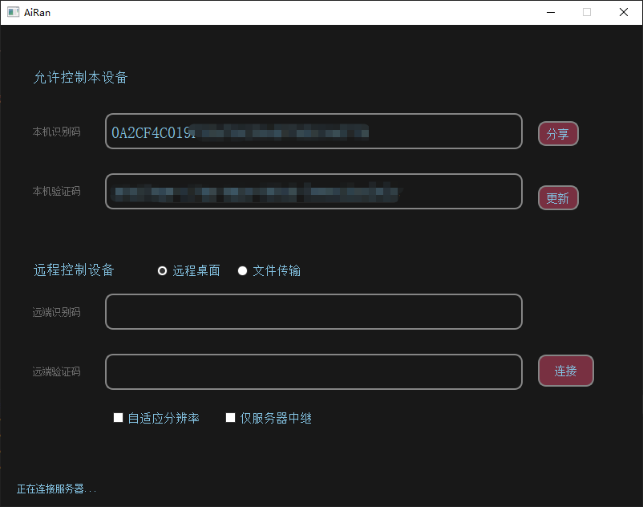
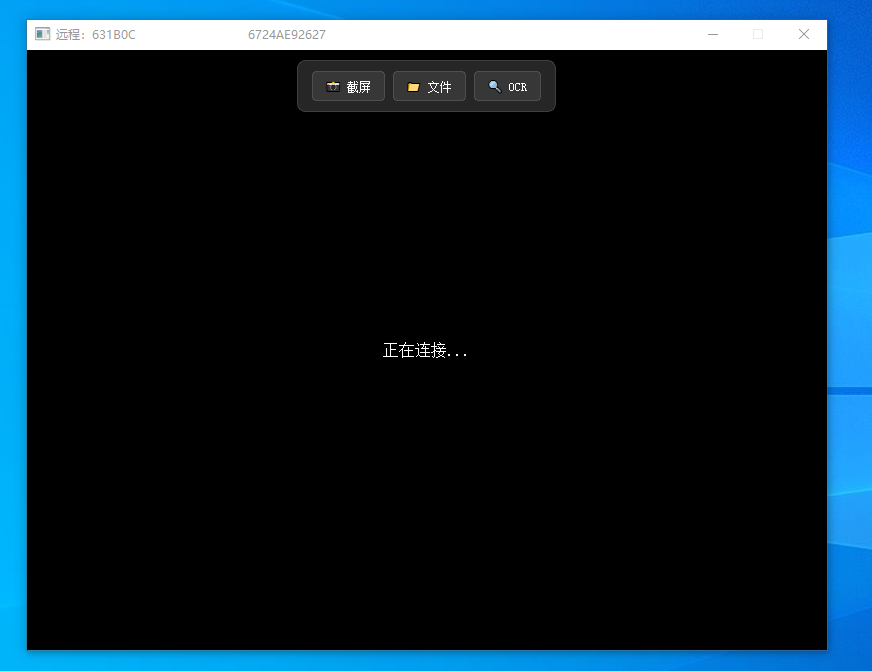

# AiRanDesk

AiRanDesk 是一个基于 WebRTC 技术的远程桌面控制应用程序，支持 Windows 和 Linux 平台。

## 功能特性

- 基于 WebRTC 的实时音视频传输
- 跨平台支持（Windows/Linux）
- 远程桌面控制
- 文件传输功能
- 低延迟的音视频编解码

## 界面



## 构建依赖

### 第三方库

本项目使用了以下优秀的开源库：

- **[Qt5](https://www.qt.io/)** - 跨平台 C++ 应用程序开发框架
  - qt5-base (Core, GUI, Widgets, Network, Concurrent)
  - qt5-websockets - WebSocket 通信支持
  - qt5-multimedia - 多媒体处理
- **[FFmpeg](https://ffmpeg.org/)** - 多媒体框架，用于音视频编解码
- **[libdatachannel](https://github.com/paullouisageneau/libdatachannel)** - WebRTC 数据通道实现
- **[spdlog](https://github.com/gabime/spdlog)** - 快速 C++ 日志库
- **[vcpkg](https://github.com/microsoft/vcpkg)** - C++ 包管理器

## 构建指南

### Windows

#### 前置要求

1. 安装 [Visual Studio](https://visualstudio.microsoft.com/) 编译环境（推荐 Visual Studio 2022）
2. 安装 [vcpkg](https://github.com/microsoft/vcpkg) 包管理器

#### 安装依赖

```cmd
vcpkg install ffmpeg[all-nonfree] libdatachannel[srtp,stdcall,ws] spdlog qt5-base[core,openssl] qt5-websockets qt5-multimedia --triplet=x64-windows
```

#### 编译

```cmd
cmake -DCMAKE_TOOLCHAIN_FILE=D:/software/vcpkg/scripts/buildsystems/vcpkg.cmake -DVCPKG_TARGET_TRIPLET=x64-windows -S . -B out/build/x64 -G "Visual Studio 17 2022" -T host=x64 -A x64

cmake --build out/build/x64 --config RelWithDebInfo --
```

### Linux (Ubuntu)

#### 前置要求

安装系统依赖：

```bash
sudo apt update
sudo apt install nasm pkg-config meson ninja-build build-essential python3 python3-jinja2 libdbus-1-dev libxi-dev libxtst-dev
sudo apt install '^libxcb.*-dev' libx11-xcb-dev libgl1-mesa-dev libxrender-dev libxi-dev libxkbcommon-dev libxkbcommon-x11-dev libfontconfig1-dev libfreetype6-dev libharfbuzz-dev
```

#### 安装依赖

```bash
vcpkg install ffmpeg[all-nonfree] libdatachannel[srtp,stdcall,ws] spdlog qt5-base[core,openssl] qt5-websockets qt5-multimedia --triplet=x64-linux
```

#### 编译

```bash
cmake --preset x64-linux
cmake --build --preset x64-linux
```

或者使用手动命令：

```bash
cmake -S . -B build -DCMAKE_TOOLCHAIN_FILE=/path/to/vcpkg/scripts/buildsystems/vcpkg.cmake -DVCPKG_TARGET_TRIPLET=x64-linux -G Ninja
cmake --build build
```

## 配置文件

编译完成后，配置文件会自动复制到输出目录：

- `config.ini` - 主配置文件（需指定signal_server的wsUrl为你自己的服务器地址）
- `locale/` - 国际化文件目录

## 致谢

感谢以下开源项目和作者的贡献：

- **Qt Team** - 提供了强大的跨平台开发框架 [Qt](https://www.qt.io/)
- **FFmpeg Team** - 提供了功能完善的多媒体处理库 [FFmpeg](https://ffmpeg.org/)
- **Paul-Louis Ageneau** - 开发了优秀的 WebRTC 库 [libdatachannel](https://github.com/paullouisageneau/libdatachannel)
- **Gabi Melman** - 开发了高性能日志库 [spdlog](https://github.com/gabime/spdlog)
- **Microsoft** - 提供了便捷的包管理器 [vcpkg](https://github.com/microsoft/vcpkg)

## 许可证

本项目采用开源许可证，详见 [LICENSE](LICENSE) 文件。

## 贡献

欢迎提交 Issue 和 Pull Request 来改进本项目。

## 联系方式

如有问题或建议，请通过 GitHub Issues 联系我们。
